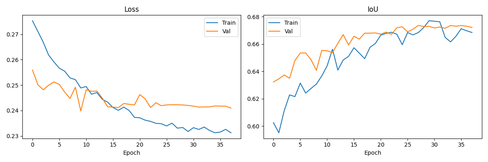

# 🏗️ Building Change Detection from Aerial Imagery

> Siamese SegFormer-B2 with Attention-Based Feature Fusion and Combined Focal+Dice+Boundary Loss on the WHU Building Change Detection Dataset.

---

## 📊 Test Results

| Metric | Score | Std |
|--------|-------|-----|
| **IoU** | **0.6196** | ±0.1958 |
| **Dice / F1** | **0.7458** | ±0.1619 |
| **Precision** | 0.7322 | — |
| **Recall** | 0.7696 | — |

---

## 🖼️ Qualitative Results

### Test Predictions


> Each row: **Before (2012)** · **After (2016)** · **Ground Truth** · **Error Map** (🟢 TP · 🔴 FP · 🔵 FN)

### Training Curves
| Loss | IoU |
|------|-----|
|  |  |

---

## 🧠 Model Architecture

**Siamese SegFormer-B2** — shared hierarchical Vision Transformer encoder with an attention-based change detection decoder.

```
Image A (2012) → Shared MiT-B2 Encoder → Features A ─┐
                                                        → ChangeAttentionModule → MLP Decoder → Change Map
Image B (2016) → Shared MiT-B2 Encoder → Features B ─┘
                    ↑ same weights, pretrained on Building Footprint task
```

### ChangeAttentionModule

Replaces naive `|F_A − F_B|` with a learned dual-attention mechanism at each of the 4 encoder scales:

```
diff = |F_A - F_B|
     ↓
Channel Attention (FC layers on global avg pooling of F_A and F_B)
     ↓  applies per-channel weighting to diff
Spatial Attention (Conv on avg+max pool of attended diff)
     ↓  applies spatial weighting
Fusion Conv: concat([F_A, F_B, attended_diff]) → C channels
```

### SegFormer-B2 Encoder Stages

| Stage | Channels | Spatial Size (512×512 input) |
|-------|----------|------------------------------|
| 1 | 64 | 128×128 |
| 2 | 128 | 64×64 |
| 3 | 320 | 32×32 |
| 4 | 512 | 16×16 |

---

## 📉 Loss Function

```
L = 0.35 · FocalLoss + 0.40 · DiceLoss + 0.25 · BoundaryLoss
```

| Term | Role |
|------|------|
| **Focal Loss** (α=0.75, γ=2.0) | Handles severe class imbalance (~6% changed pixels) |
| **Dice Loss** | Directly optimizes overlap between prediction and ground truth |
| **Boundary Loss** | Laplacian edge-weighting — 3× penalty near change boundaries for precise delineation |

---

## 📁 Dataset — WHU Building Change Detection

Aerial images of Christchurch, New Zealand before and after the 2011 earthquake.

| Split | Tiles | Changed Pixels |
|-------|-------|----------------|
| Train | 1,134 | 6.46% |
| Val | 126 | 6.18% |
| Test | 690 | 5.11% |

Each tile: 512×512 RGB, paired (same location, 2012 vs 2016).

Download: [WHU Building Dataset](https://gpcv.whu.edu.cn/data/building_dataset.html)

**Folder structure after preprocessing:**
```
WHU_CD_processed/
├── train/
│   ├── A/        ← 2012 images (before)
│   ├── B/        ← 2016 images (after)
│   └── label/    ← binary change masks
├── val/
└── test/
```

---

## ⚙️ Training Configuration

| Parameter | Value |
|-----------|-------|
| Model | SegFormer-B2 (`nvidia/mit-b2`) |
| Optimizer | AdamW |
| Encoder LR | 1e-5 (10× lower) |
| Decoder LR | 1e-4 |
| Scheduler | OneCycleLR (per-step) |
| Batch Size | 8 |
| Epochs | 50 (early stopping, patience=15) |
| Encoder warmup | Frozen for first 5 epochs |
| Loss Weights | Focal=0.35, Dice=0.40, Boundary=0.25 |

---

## 🔑 Key Contributions

**1. Domain-specific pretraining**
The SegFormer-B2 encoder is initialized from a model pretrained on the Building Footprint Extraction task — not just ImageNet. This gives the encoder a head start on understanding aerial building appearance before change detection training begins.

**2. ChangeAttentionModule**
Replaces simple feature subtraction with a dual channel+spatial attention mechanism that learns which parts of the feature difference are most relevant for detecting change.

**3. Boundary-aware loss**
Applies 3× higher loss weight near change boundaries using a Laplacian filter and dilation — producing sharper and more geometrically precise change maps.

---

## 📂 Repository Structure

```
Building Change Detection from Aerial Imagery/
├── Building_Change_Detection.ipynb   ← Fully documented notebook
├── README.md
└── assets/
    ├── test_result.png               ← Before/After/GT/ErrorMap visualization
    ├── curves.png                    ← Training loss and IoU curves
    └── datasetsample.png             ← Dataset sample visualization
```

---

## 🚀 Getting Started

### 1. Clone the repo
```bash
git clone https://github.com/SaynaSarvar/building-change-detection.git
cd building-change-detection
```

### 2. Install dependencies
```bash
pip install torch torchvision transformers albumentations rasterio tqdm matplotlib pillow
```

### 3. Download dataset
Download from the [official WHU page](https://gpcv.whu.edu.cn/data/building_dataset.html) (Building change detection dataset, ~5.4 GB).

### 4. Get the pretrained footprint model
This project requires [`best_model.pth`](https://drive.google.com/file/d/1GgygNaeDE2XN5OiTlUj5FQKcqoNtUipC/view?usp=sharing) from the [Building Footprint Extraction](https://github.com/SaynaSarvar/building-footprint-segformer) project. 

### 5. Open in Colab
Open `Building_Change_Detection.ipynb` in Google Colab with a T4 GPU runtime. All preprocessing, training, and evaluation steps are in the notebook.

---

## 🔗 Related Project

This project is the second part of a two-stage remote sensing pipeline:

| Project | Task | IoU |
|---------|------|-----|
| [Building Footprint Extraction](https://github.com/SaynaSarvar/building-footprint-segformer) | Segment buildings from single aerial image | 0.8590 |
| **Building Change Detection** (this) | Detect building changes between two aerial images | 0.6196 |

The footprint model's encoder is directly reused here — connecting the two projects into a coherent research narrative.

---

## 📌 Citation

If you use the WHU Building Dataset, please cite:

```bibtex
@article{ji2018fully,
  title={Fully Convolutional Networks for Multi-Source Building Extraction
         from an Open Aerial and Satellite Imagery Data Set},
  author={Ji, Shunping and Wei, Shiqing and Lu, Meng},
  journal={IEEE Transactions on Geoscience and Remote Sensing},
  year={2018},
  doi={10.1109/TGRS.2018.2858817}
}
```

---

## 👩‍💻 Author

**Sayna Sarvar**
B.Sc. Computer Engineering, Tabriz University
Researcher, University of Tabriz

[](https://github.com/SaynaSarvar)

---

## 📄 License

This project is released under the MIT License.
